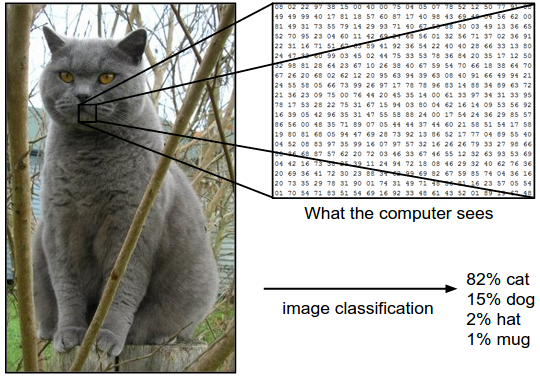
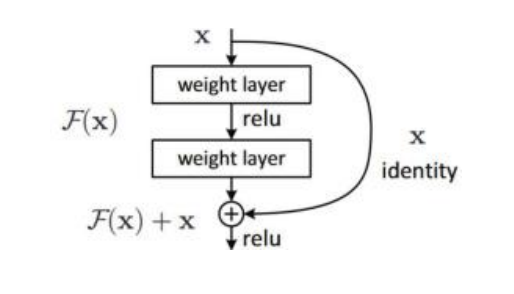
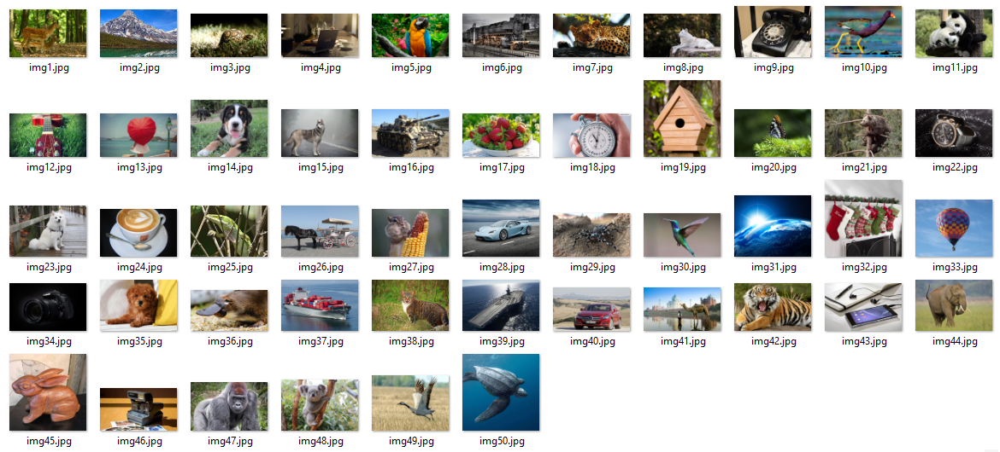
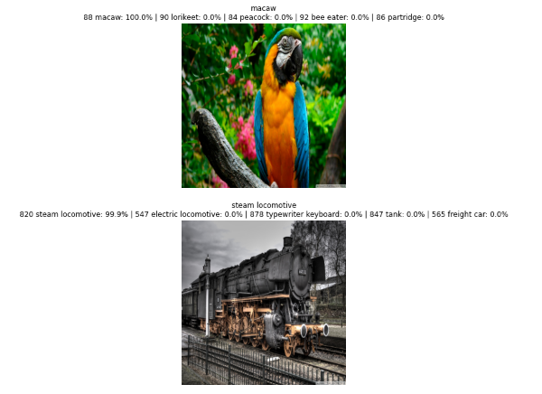
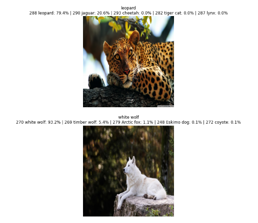
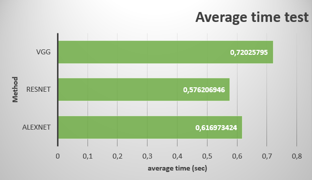
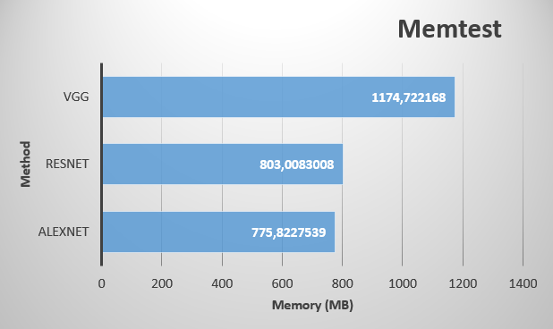

<h1 align="center">Лабораторная работа №3.</h1>

<h2 align="center">Простые системы классификации изображений на основе сверточных нейронных сетей.</h2><br>

<p align="center"><b>Теоретическая база</b><p>

Одной из классических задач машинного зрения является задача классификации изображений – процесс извлечения классов информации из многоканального растрового изображения. 
<figure>
  <p align="center"></p>
</figure>
<p align="justify"><i>Задача классификации изображений состоит в том, чтобы предсказать единственную метку (или распределение по меткам, как показано на рисунке, чтобы определить степень принадлежности или вероятность) для данного изображения. Изображения представляют собой трехмерные массивы целых чисел от 0 до 255, размером ШхВх3. Число 3 — представляет собой три цветовых канала красный, зеленый, синий.</i></p><br>

Оценка качества алгоритмов машинного обучения производится на аннотированных базах изображений,таких как CIFAR-10, ImageNet и др. В связи с тем, что изображения базы ImageNet могут содержать несколько различных объектов, аннотирован из которых только один, в виде основной оценки применяется top-5 ошибка, суть которой заключается в том, что, присутствие искомой категории в пяти наиболее вероятных предсказаниях считается правильным ответом.
Сверточные сети позволяют специализировать нейронные сети для работы с данными, имеющими четко выраженную сеточную топологию, и хорошо масштабировать такие модели к задачам очень большого размера. Особенно успешным этот подход оказался в применении к двумерным изображениям.
На данный момент лучше всего с обработкой изображений справляются свёрточные нейронные сети.
Основное отличие этой архитектуры от построения классических нейронных сетей заключается в наличии слоёв свёртки (convolutional layer) – скрытых слоев нейронной сети, в которых происходит свёртка изображения, с помощью фильтров, а также слоев субдискретизации (pooling layer) и полносвязных слоев (fully connected layers).

<b><i> AlexNet </b></i>

Krizhevsky et al. представили сеть AlexNet которая обучалась на двух GPU, что позволила ускорить время обучения. Также использовалась функция активации ReLU вместо арктангенса, что уменьшило количество необходимых для обучения эпох в шесть раз. Формула ReLU представлена ниже:
```
𝑦(𝑥) = max(0; 𝑥)
```
Помимо функции активации, одной из особенностей является применение метода прореживания (Dropout). Это метод регуляризации для нейронных сетей, которые способствует в борьбе с переобучением, путем отключения случайных нейронов.

<b><i> ResNet </b></i>

Данная архитектура была разработана He et al. из Microsoft Research. Авторы ResNet обнаружили следующее: при увеличении количества слоев сети возможно уменьшение точности на валидационном множестве. Причем на тренировочном множестве точность также падает, из чего делается вывод о том, что данная проблема не связана с переобучением. Это связано с проблемой исчезающего градиента, что является технической проблемой приводящей к невозможности обучения сети в принципе. He et al. для решения этой проблемы использовали остаточное отображение (элемент, который следует добавить ко входным данным) вместо отображения как такового в обучении. Это делается с помощью соединения, показанного на рисунке ниже.

<figure>
  <p align="center"></p>
</figure>
<p align="center"><i>Остаточное отображение ResNet</i></p><br>

Данная архитектура позволила избежать проблему исчезающего градиента и обучать крайне глубокие
сети.

<b><i> VGG </b></i>

В 2014 году Simonyan и Zisserman представили архитектуру сети под названием VGG. Основной и отличительной идеей этой структуры является сохранение фильтров настолько простыми, насколько это возможно. Они продемонстрировали, что использование фильтра 7х7 эквивалентно использованию трех фильтров 3х3, при этом, количество параметров получается на 55% меньше во втором случае. Одновременно с простотой сверточных модулей они увеличили сеть в глубину до 19 слоев.

<p align="center"><b>Описание разработанной системы</b><p><br>

Работа состоит из 5 пунктов:

1) Создаём датасет и список.
2) Инициализация модели.
3) Инициализиция и использование препроцессинга для изображения.
4) Предсказывание классы предмета из изображении с помощью модели.
5) Вывод изображения с первыми top-5 наиболее вероятными классами для предмета на изображении.

<b>1) Создаём датасет и список.</b>

Подбираем 50 изображении и сохраняем в гугл диск. С гугл диска загружаем изображении и создаём список с предметом который присутствует на этих изображениях.
```
imgs = []
for i in range(1,51):
  imgs.append(read_image(f"drive/MyDrive/LAB 3/datasets/img{i}.jpg").cuda())

text = ['gazelle', 'Alp', 'mud turtle', 'laptop', 'macaw', 'steam locomotive', 'leopard', 'white wolf', 'dial telephone', 'European gallinule', 'giant panda', 'acoustic guitar', 'umbrella', 'Greater Swiss Mountain dog', 'Siberian husky', 'tank', 'strawberry', 'stopwatch', 'birdhouse', 'cabbage butterfly', 'brown bear', 'digital watch', 'Eskimo dog', 'coffee mug', 'American chameleon', 'horse cart', 'corn', 'sports car', 'wolf spider', 'hummingbird', 'earthstar', 'Christmas stocking', 'ballon', 'reflex camera', 'toy poodle', 'platypus', 'container ship', 'tiger cat', 'aircraft carrier', 'passenger car', 'Arabian camel', 'tiger', 'cellular telephone', 'Indian elephant', 'wood rabbit', 'Polaroid camera', 'gorilla', 'koala', 'crane bird', 'leatherback turtle' ]
```
<figure>
  <p align="center"></p>
</figure>
<p align="center"><i>All datasets</i></p><br><br>

<b>2) Инициализация модели.</b>

Мы смотрим метод `AlexNet`.
Импортируем метод и её веса "AlexNet_Weights" из библиотеки `torchvision.models`. Так как мы смотрим метод без обучения, мы вызываем следующую команду `model.eval()`.

```
import torch
import torchvision
from torchvision.io import read_image
from torchvision.models import alexnet, AlexNet_Weights

weights = AlexNet_Weights.IMAGENET1K_V1
model = alexnet(weights=weights).cuda()
model.eval()
```
<b>3) Инициализиция и использование препроцессинга для изображения.</b>

Инициализируем препроцессинг и передаём в модел.
```
preprocess = weights.transforms()
```

После инициализации применяем препроцессинг для каждого изображения.
```
for i in range(len(imgs)):

  batch = preprocess(imgs[i]).unsqueeze(0)
```
<b>4) Предсказывание классы предмета из изображении с помощью модели.</b>

Процесс предсказание и запись в переменную "prediction":

```
prediction = model(batch).squeeze(0).softmax(0) 
```

Процесс запись в переменную "top_prediction" тензор из 5-ти наиболее вероятных классов для предмета на изображении. 

```
top_prediction = torch.topk(prediction.flatten(), n_top_predict).indices
```

Создаём список "top_prediction_ind", в нём будет из тензора индексы 5-ти наиболее вероятных классов. 

```
top_prediction_ind = [e.item() for e in top_prediction]
```

Создаём список "all_score", тут хранится вероятность для каждого из 5-ти наиболее вероятных классов.

```
all_score = [prediction[e].item() for e in top_prediction_ind]
```

Создаём список "category_names" и запишем имена 5-ти наиболее вероятных классов. 

```
category_names = [weights.meta["categories"][e] for e in top_prediction_ind]
```

Cоздаём список `array_description`, в нём описание для каждого изображения. 

```
array_descript = [f"{top_prediction_ind[e]} {category_names[e]}: {100 * all_score[e]:.1f}%" for e in range(n_top_predict)]
```

и сохраняем этот список в общий список "description" всего датасета.

```
description = []
```

```
description.append(" | ".join(array_descript))
```

<b>5) Вывод изображения с первыми top-5 наиболее вероятными классами для предмета на изображении.</b>

Вывод всех изображении поочерёдно с их описаниями, мы напишем следующим образом: 
```
import os
import cv2
from matplotlib import pyplot as plt
import torchvision.transforms as T

transform = T.Resize((500,500))

if type(imgs[0]) == torch.Tensor:
  imgs = [i.cpu() for i in imgs]
  imgs = [transform(i).data.numpy().transpose((1,2,0)) for i in imgs]

pic_box = plt.figure(figsize=(400,300))
for i, pic in enumerate(imgs):
  pic=imgs[i]
  pic_box.add_subplot(50,1,i+1)
  plt.imshow(pic)
  plt.axis('off')
  plt.title(f'{text[i]}\n{description[i]}')
  
plt.show()
```
<figure>
  <p align="center"></p>
</figure>
<figure>
  <p align="center"></p>
</figure>

<p align="center"><i>Вывод результата (выбрал для показа 4 изображении)</i></p><br><br>


<p align="center"><b>Сравнение скорости и количество потребляемой паияти для каждой архитектуры</b><p>

Протестируем среднее время выполнения каждой из методов:

```
import time
start = time.time()
prediction = model(batch).squeeze(0).softmax(0)
end = time.time()
test.append(end-start)

time_test[:10]
```

Результат:

<figure>
  <p align="center"></p>
</figure>
<p align="center"><i>Среднее время выполнения</i></p><br><br>

Теперь протестируем использование памяти каждой из методов: 
```
memory_test = torch.cuda.max_memory_allocated()
torch.cuda.reset_peak_memory_stats()

memory_test / 1024**2
```
Результат:

<figure>
  <p align="center"></p>
</figure>
<p align="center"><i>Потребление памяти</i></p><br><br>

<h4 align="center">Вывод</h4>

В данной лабораторной работе были рассмотрены одни из самых значимых архитектур свёрточных нейронных сетей для задачи классификации изображений, а также было проведено их сравнение по времени и ресурсозатратам. Видно что AlexNet более эффективный вариант в плане ресурсозатрат, но чуть уступает по средней времени выполнении. 